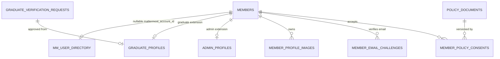

# 06. 데이터 모델

## 진실 소재

- `supabase/migrations/**`가 스키마의 단일 진실이다. 운영 Production·Preview는 이 마이그레이션을 운영자가 순서대로 적용하고, 수신기는 적용 승인된 마이그레이션 tree와 다른 배포를 거절한다.
- `supabase/schema.sql`은 마이그레이션에서 파생된 **스냅샷**이다. 현재 형태를 읽기 쉽게 보여 주지만 마이그레이션과 어긋날 수 있다. 자체 호스팅 DB 초기화 입력으로 쓰지 않는다. 어긋나면 스냅샷을 고치고, 이미 적용된 마이그레이션 파일은 수정하지 않는다([리팩토링 기본 결정 D9](../plans/active/refactor-program-2026-10.md#기본-결정)).
- `npm run validate:migrations`는 파일명 규칙과 함께 스냅샷 드리프트를 막는다. 함수별 최종 시그니처 집합이 migrations와 같아야 하고, migrations가 남긴 인덱스는 스냅샷에도 있어야 하며, 삭제된 컬럼을 가리키는 인덱스 정의와 `)` 앞 끝 쉼표 같은 구문 오류가 없어야 한다. 스냅샷에만 있는 초기 인덱스(어느 migration도 만들지 않은 기준선)는 운영 DB 확인 전까지 그대로 둔다. 구현은 `scripts/lib/supabase-schema-snapshot.mjs`, 회귀 테스트는 `tests/supabase-schema-snapshot-guard.test.mts`다.
- 함수 본문까지 최신 migration과 같은지 비교하거나 `pg_dump`로 스냅샷을 재생성하는 일은 아직 하지 않는다. `schema.sql` 텍스트를 직접 읽는 계약 테스트가 약 40개(2026-10-05 기준)라 재생성은 별도 작업으로 다룬다.
- 보존·파기 기간과 실행 경로는 [데이터 수명주기](../security/data-lifecycle.md)가 정본이다.
- 이 문서는 테이블·함수를 손으로 나열하지 않는다. 손으로 만든 목록은 금방 빠지고 틀려진다. 목록이 필요하면 아래 명령으로 마이그레이션에서 직접 뽑는다.

```bash
# 현재 테이블: 마이그레이션 순서대로 create·drop·rename을 적용한다(SQL 주석 제외)
cat supabase/migrations/*.sql | sed -E 's/--.*$//' | tr 'A-Z' 'a-z' \
  | grep -oE "(create table (if not exists )?|drop table (if exists )?)(public\.)?\"?[a-z_0-9]+|alter table (if exists )?(only )?(public\.)?[a-z_0-9]+ rename to [a-z_0-9]+" \
  | awk '{
      if ($1 == "alter") { for (i = 1; i <= NF; i++) if ($i == "rename") { o = $(i - 1); n = $(i + 2) }; sub(/^public\./, "", o); if (o in t) { delete t[o]; t[n] = 1 }; next }
      n = $NF; sub(/^public\./, "", n); gsub(/"/, "", n)
      if ($1 == "create") t[n] = 1; else delete t[n]
    } END { for (k in t) print k }' | sort

# 한 번이라도 정의된 함수(RPC·trigger) 이름(SQL 주석 제외)
cat supabase/migrations/*.sql | sed -E 's/--.*$//' | grep -oiE "create (or replace )?function (public\.)?[a-z_0-9]+" | sed -E 's/.* (public\.)?//I' | tr 'A-Z' 'a-z' | sort -u

# 특정 테이블·함수의 최신 정의가 들어 있는 마이그레이션
grep -l "<name>" supabase/migrations/*.sql | sort | tail -1
```

스냅샷의 테이블·함수·인덱스는 마지막 forward migration의 상태와 일치해야 한다. RF-02는 삭제된 `member_auth_identities` 잔존을 비롯한 스냅샷 드리프트를 정리하고 검증 가드를 추가했다.

## 도메인별 테이블 지도

테이블 이름 접두사가 도메인을 나타낸다. 새 테이블도 같은 접두사를 따른다.

| 도메인 | 테이블 접두사·대표 테이블 | 비고 |
| --- | --- | --- |
| 공개 제휴 카탈로그 | `categories`, `partners`, `partner_benefits`, `partner_companies`, `partner_company_branches`, `partner_offer_branches`, `partner_brand_profiles`, `public_cache_versions` | `public_cache_versions`가 공개 캐시 key의 기준이다. |
| 협력사 포털 | `partner_accounts`, `partner_account_companies`, `partner_auth_attempts`, `partner_change_requests`, `partner_plan_upgrade_requests`, `partner_brand_plan_events`, `partner_billing_*`, `partner_tax_documents`, `partner_preview_tokens` | 결제·세금 문서는 정산 증거다. |
| 협력사 등록 신청 | `partner_registration_*` | 외부 신청 본문과 레이트리밋 |
| 회원·인증 | `members`, `mm_user_directory`, `member_*`(이메일·비밀번호 작업·식별자 예약·가입 승인·프로필 사진·알림·Wallet), `mattermost_*`, `password_reset_attempts`, `manual_member_import_*` | 아래 회원 도메인 원칙을 따른다. |
| 수료생 | `graduate_profiles`, `graduate_verification_*`, `graduate_email_challenges` | 비공개 파일은 정해진 기간 뒤 정리한다. |
| 관리자 | `admin_accounts`, `admin_profiles`, `admin_permissions`, `admin_permission_templates`, `admin_login_attempts`, `admin_audit_logs` | 권한의 원천은 `admin_profiles.permission_template_key`와 템플릿이다. |
| 약관·기수 | `policy_documents`, `member_policy_consents`, `ssafy_cycle_settings`, `ssafy_cohort_card_themes` | 정책 문서는 수정하지 않고 새 버전을 발행한다. |
| 리뷰·즐겨찾기·혜택 사용 | `partner_reviews`, `partner_review_reactions`, `partner_favorites`, `partner_benefit_usages` | `partner_benefit_usages`는 로그가 아니라 혜택 사용 원장이다. |
| 광고·쿠폰·프로모션·이벤트 | `ad_*`, `promotion_events`, `promotion_slides`, `event_reward_*` | 쿠폰 발급·사용은 RPC로 원자 처리한다. |
| 쇼케이스 | `showcase_*` | 정산 뒤 정해진 기간에 개인정보 연결을 파기한다. |
| 알림·푸시 | `notifications`, `notification_deliveries`, `notification_templates`, `push_*`, `admin_notification*`, `admin_push_subscriptions`, `partner_notification*`, `partner_push_subscriptions`, `partner_publication_notification_states`, `operational_notification_dedupes` | 회원·관리자·협력사 audience별 테이블을 섞지 않는다. |
| 로그·지표·보존 | `event_logs`, `auth_security_logs`, `partner_metric_*`, `platform_active_identities`, `log_retention_holds`, `suggestion_attempts` | 보존·파기 기준은 [이벤트 로깅](./event-logging.md)과 [데이터 수명주기](../security/data-lifecycle.md)를 따른다. |
| 업로드 | `image_upload_sessions`, `image_upload_quota_windows`, `image_asset_migrations` | 마지막 테이블은 일회성 이관 기록이다. |
| Apple Wallet | `member_wallet_passes`, `member_wallet_pass_revisions`, `member_wallet_pass_operations`, `apple_wallet_device_registrations` | 기능은 현재 비활성이다. |

`member_ssafy_verifications`는 런타임에서 읽지 않는 SSAFY Verify 레거시 테이블이다. 삭제 조건은 [SSAFY Verify 레거시 삭제 준비](../plans/active/ssafy-verify-legacy-removal.md)를 따른다.

## 회원 도메인 원칙

- `members`는 공통 계정·프로필 원장이다. 교육생·수료생·운영진을 별도 회원 테이블로 나누지 않는다.
- 교육생과 수료생의 핵심 분류값은 `generation`(기수)이다. 운영진은 `generation = 0`이고 확인 원본 기수는 `staff_source_generation`에 둔다. 기수 계산은 `ssafy_cycle_settings`와 날짜로 파생한다.
- Mattermost, 수료생, 관리자 권한, 약관 동의는 1:1 또는 이력 확장 테이블로 분리한다. 회원 테이블은 `mattermost_account_id` 같은 nullable FK만 갖고, Mattermost 세부값은 `mm_user_directory`가 보관한다.
- 로그인 식별자는 Mattermost 아이디 또는 인증된 이메일이다. 반·강의실·반장처럼 운영에 불필요한 닉네임 파생값은 저장하지 않는다.
- 외부 프로필 사진은 원본이나 data URL로 보관하지 않는다. 서버에서 정규화한 WebP를 private `member-profile-images` 버킷과 `member_profile_images` 원장에 저장하고, 권한을 확인하는 이미지 API로만 읽는다. 과거의 `members.avatar_base64` 열은 삭제됐다.
- `deleted_at`이 있는 회원은 즉시 로그인·권한·혜택 접근이 막힌다. 정해진 기간 뒤 익명화하지만 HMAC 식별자 예약과 필요한 감사 이력은 남긴다.



## Apple Wallet 키 경계

Wallet QR 서명과 Apple `authenticationToken` 원문은 DB에 저장하지 않는다. `public_id`, Pass Type ID, 설치 수명 동안 불변인 32바이트 Wallet master key로 값을 결정적으로 만들되 QR 서명, ApplePass 인증, device library identifier hash, APNs token 암호화마다 HMAC-SHA256 context가 다른 subkey를 파생한다. `APPLE_WALLET_AUTH_SECRET*`는 Wallet 발급·검증 계약에 사용하지 않는다. Master key 회전은 단순 환경 변수 교체가 아니라 저장 APNs token 재암호화, device hash 재생성 또는 재등록, 기존 pass 폐기·재발급과 QR 교체를 포함하는 별도 migration이다.

## 마케팅 수신 자격

광고성(마케팅) 알림 수신 자격은 활성 마케팅 정책에 대한 `member_policy_consents` 행과 `push_preferences.marketing_enabled = true`를 함께 만족해야 한다. 철회는 `marketing_enabled`만 끄고 동의 행은 감사 증적으로 남기므로, 동의 행 존재만으로 판정하지 않는다. 판정 규칙은 `src/lib/notifications/marketing-consent.ts` 한 곳에 두고 관리자 캠페인 발송·회원 목록·이벤트 조건·회원 설정 화면이 같이 쓴다.

## RLS and indexes

- 모든 `public` 테이블은 row level security가 enable되어 있고 `anon`·`authenticated`·`PUBLIC` 권한이 없다. 과거 `categories`, `partners`의 public read policy는 `20260831090039`에서 제거했다.
- 함수와 새 객체의 기본 권한도 브라우저 역할에 닫혀 있다. 기준은 [Service Role 접근 경계](../security/service-role-boundary.md#db-권한-기본값)다.
- 앱 서버는 대부분 service role admin client를 사용하므로 API/server action 경계 검증이 필수 방어선이다.
- 인덱스를 추가·삭제할 때는 스냅샷이 아니라 마이그레이션과 운영 DB 사용 통계를 근거로 한다. 사용 통계 없이 인덱스를 지우지 않는다([기술 부채 원장](../plans/tech-debt.md#성능ux운영)).

## 마이그레이션 시 보존해야 하는 상태값

- partner visibility: `public`, `confidential`, `private`
- partner visibility state: 기간 만료는 저장값이 아니라 `period_start/end`와 현재 시각으로 계산한다.
- benefit visibility: `public`, `eligible_only`
- audience: `staff`, `student`, `graduate`
- campus slug: `seoul`, `gumi`, `daejeon`, `busan-ulsan-gyeongnam`, `gwangju`
- admin permission resource/action: `admin-permissions.ts`의 상수와 DB row가 일치해야 한다.
- notification audience별 table 분리: member/admin/partner notification을 섞지 않는다.
- password/session/token 원문은 DB와 로그에 저장하지 않는다.
- Wallet 발급 선행 조건은 별도 저장 상태가 아니라 현재 회원 상태에서 계산한다. 게이트 우선순위는 기존과 동일하게 `비밀번호 변경 -> 필수 약관 동의 -> 본인 사진 -> 원래 목적지`다.
