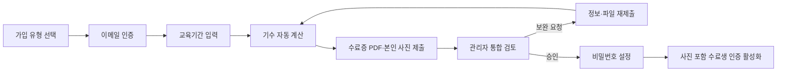

# 수료생 증명서·프로필 사진 인증 v1

작성 기준일: 2026-07-12
관련 이슈: #102
화면 계약: [수료생 증명서·본인 사진 인증](../product/screen-specs/graduate-verification.md)

## 목적과 비범위

수료생은 Mattermost(SSAFY Verify) 계정이 없을 수 있다. v1은 이메일 인증, 교육이수증 PDF, 본인 사진의 **사람 검토**로 수료생 이메일 계정을 만든다.

- 1학기·2학기 이수자는 같은 수료생 혜택 자격을 얻고, 이수 단계만 보관한다.
- 관리자는 PDF의 교육기간과 신청 정보를 대조하고 사진의 인증 카드 적합성만 본다.
- 신분증, 얼굴 인식, 생체 특징 추출, 자동 신원 비교를 하지 않는다.
- 기존 MM/SSAFY Verify 회원은 재인증하지 않으며 기존 아바타와 로그인 경로를 유지한다.

## 흐름



## 기수 규칙

규칙 식별자는 `ssafy-half-year-v1`이며, 서버의 `getSsafyCohortFromEducationStart()`가 유일한 계산 주체다. 클라이언트 값은 표시용이고 제출 시 무시한다.

```ts
if (year === 2018 && month === 12) return 1;
if (year < 2019) return null;
return (year - 2019) * 2 + (month >= 7 ? 2 : 1);
```

신청에는 다음을 저장한다.

- `education_start_year`, `education_start_month`
- `education_end_year`, `education_end_month`
- `inferred_cohort`, `cohort_rule_version`
- `completion_stage` (`semester_1` 또는 `semester_2`)
- 자가 입력 `campus` — 혜택 권한 판단에는 사용하지 않음

## 데이터 모델

| 모델 | 책임 |
| --- | --- |
| `member_auth_identities` | 기존 `mattermost`와 수료생 `graduate_email` 로그인 식별자를 회원에 연결한다. |
| `graduate_verification_requests` | 이메일, 교육기간, 기수, 수료증 hash/path, 상태·검토·삭제 일정을 보관한다. |
| `member_profile_images` | 본인 사진의 private Storage 메타데이터와 `pending/approved/rejected/superseded` 상태를 보관한다. |
| `graduate_email_challenges` | 이메일 인증/재설정의 코드 hash, 시도 횟수, 만료를 보관한다. |
| `graduate_verification_uploads` | short-lived signed upload의 격리 객체와 요청 또는 회원 소유자를 보관한다. |
| `member_password_action_tokens` | 최초 비밀번호 설정·이메일 재설정용 단기 token hash를 보관한다. |

`members.mm_user_id`와 `members.mm_username`은 수료생 이메일 회원을 위해 nullable이며, `graduate_verified_at`이 존재하면 수료생 권한 판정이 기수보다 우선한다. `members.active_profile_image_id`는 승인된 사진만 가리킨다.

### 상태

```text
draft → submitted → in_review
in_review → needs_resubmission → submitted
in_review → approved
in_review → rejected
draft/submitted/needs_resubmission → withdrawn
```

보완 요청은 `education_period`, `certificate`, `profile_image`을 독립적으로 기록한다. 기존 요청의 보완에서는 요청된 파일만 새로 받으며, 이전 사진/수료증은 새 검토 파일이 연결될 때까지 private 상태로 유지한다.

## 파일 처리와 보관

| 대상 | 입력 제약 | 처리 | 보관 |
| --- | --- | --- | --- |
| 교육이수증 | PDF, 10MB 이하, 5페이지 이하 | MIME + `%PDF-` + `pdf-lib` parse + 암호화/JS/첨부 marker 검사 | private `graduate-certificates`; 승인·반려·철회 후 30일 내 삭제 |
| 본인 사진 | JPEG/PNG/WebP, 5MB 이하, 최소 320×320, 비애니메이션 | `sharp` 재디코딩, 중앙 1:1 crop, 640×640 WebP 재인코딩, EXIF/GPS/ICC/원본 파일명 제거 | private `member-profile-images`; 활성 사진은 인증 유지 기간, 거절·교체본은 30일 후 삭제 |

브라우저는 UUID 기반 short-lived signed upload URL로 격리 경로에만 업로드한다. Storage bucket도 수료증은 PDF·10MB, 사진은 JPEG/PNG/WebP·5MB로 제한한다. 서버가 검증·재인코딩을 끝낸 뒤 원본 intake 파일을 삭제하며, 남은 미제출 객체는 cron이 24시간 후 정리한다.

## 접근 제어

- 새 테이블은 RLS를 켜고 `anon`·`authenticated`의 broad table access를 revoke한다. 앱 서버의 service role만 저장소와 repository를 사용한다.
- 수료증/사진 bucket은 `public = false`다. Storage object 경로나 안정적인 public URL을 클라이언트 데이터에 저장하지 않는다.
- `/api/certification/profile-image`는 본인 로그인 세션과 활성 승인 사진을 확인한다.
- `/api/certification/avatar/[token]`는 유효·미만료 QR token을 확인하고 동일 사진을 `private, no-store`로 스트리밍한다.
- 관리자 viewer와 결정 API는 `graduate_verifications.read/update`를 확인한다. 감사 로그에는 요청/이미지 식별자와 결정만 남기고 이메일, 문서번호 원문/HMAC, Storage path, signed URL을 남기지 않는다.
- 승인 RPC는 회원, `graduate_email` identity, 승인 이미지, `active_profile_image_id`, 초기 비밀번호 token을 하나의 DB 트랜잭션으로 만든다.
- 승인 메일 전송이 실패하면 승인 자체와 사진 활성화는 되돌리지 않는다. 대신 아직 비밀번호를 설정하지 않은 승인 건에 한해 관리자가 새 one-time token을 발급해 설정 메일을 재발송할 수 있다.
- 비밀번호 설정·재설정 이메일의 one-time token은 `/auth/graduate/setup#token=…` fragment로만 전달한다. fragment는 서버·referrer로 전송되지 않으며, 클라이언트는 이를 읽은 즉시 주소에서 제거한 뒤 same-origin API 본문으로 한 번만 제출한다.

## 배치 작업

`/api/cron/cleanup-graduate-verification-files`는 `CRON_SECRET` 또는 관리자 세션을 요구한다.

1. 24시간이 지난 미소비 intake upload 삭제
2. `certificate_delete_after`가 지난 수료증 삭제 및 `certificate_deleted_at` 기록
3. 30일이 지난 `rejected`·`superseded` 사진 삭제 및 `deleted_at` 기록

응답은 건수만 반환하며 private path나 개인정보는 반환·로그하지 않는다.

## 환경 변수

| 변수 | 용도 |
| --- | --- |
| `GRADUATE_VERIFICATION_HMAC_SECRET` | 이메일/문서 HMAC 및 HttpOnly 신청 세션 서명. 32자 이상, production 전용 secret |
| `SMTP_*` | 이메일 인증 코드와 비밀번호 설정/재설정 메일 전송 |
| `CRON_SECRET` | Vercel Cron의 private 파일 정리 endpoint 인증 |

## 검증 기준

- 기수 경계, 상태 전이, 파일 형식/메타데이터 제거, 문서번호 HMAC·활성 수료증 파일 hash 중복 차단을 Node unit test로 고정한다.
- 신규·보완·사진 교체 승인·비밀번호 설정은 repository/integration test로 고정한다.
- E2E는 수료생 신청, 사진만 보완, 관리자 승인, 사진 교체, 기존 MM 회원 회귀를 분리한다.
- 360/430/820/1366에서 신청, 인증 카드, QR 검증 사진 상태의 Story/시각 기준선을 유지한다.
